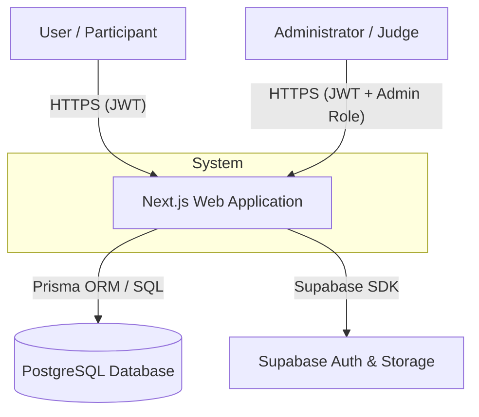
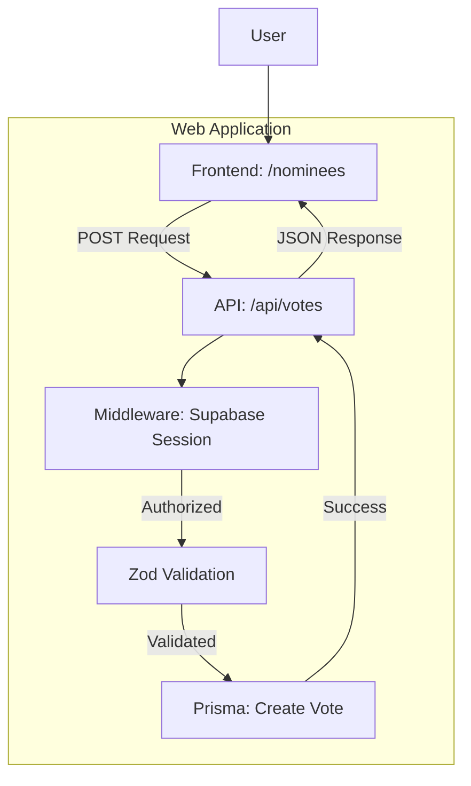
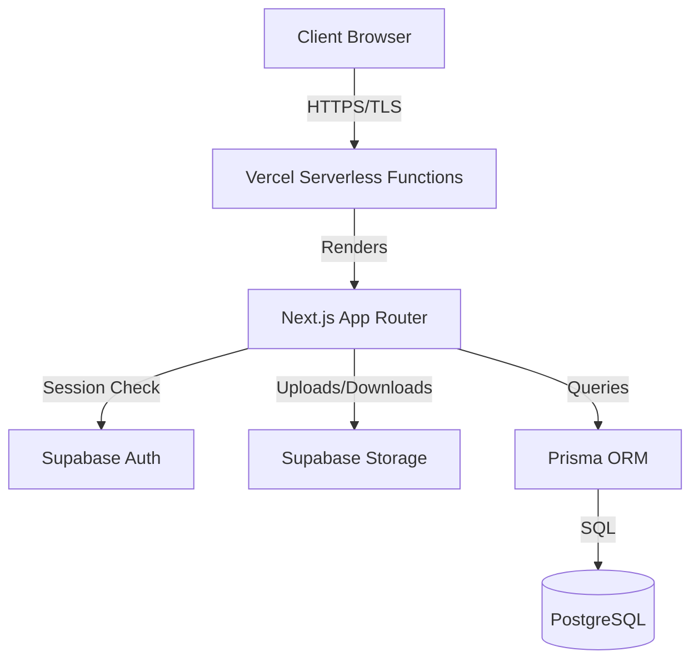

# Cultural Ambassador Award - Project & Security Documentation

Welcome to the official repository for the **Cultural Ambassador Award** platform. This project is a comprehensive web application designed to recognize and celebrate Ethiopian cultural excellence through a secure voting and nomination system.

This document serves as both the **Project Master Guide** and the **Technical Documentation for Web Application Security Testing**, as required by the Information Network Security Administration (INSA).

---

## 1. Project Overview

The Cultural Ambassador Award platform serves three primary roles:
- **Participants**: View nominees, learn about cultural heritage, and cast votes.
- **Submitters**: Public users who can nominate themselves or others for various award categories.
- **Administrators/Judges**: Manage the entire lifecycle of categories, nominees, votes, and submissions through a secure admin dashboard.

### Core Features
- **Secure Voting Engine**: One vote per user, per nominee, enforced via Prisma unique constraints and server-side authentication.
- **Content Management System**: Full CRUD for Categories, Nominees, and Media galleries.
- **Submission Processing**: Automated workflow for reviewing public nominations.
- **AI Integration**: Infrastructure powered by Google Genkit (Gemini) for cultural content suggestions.
- **Dynamic Marketing**: Configurable popups and sidebar advertisements managed via the admin panel.

---

## 2. Technical Stack

| Component | Technology |
| :--- | :--- |
| **Framework** | Next.js 15 (App Router) |
| **Language** | TypeScript |
| **Runtime** | Node.js |
| **ORM** | Prisma |
| **Database** | PostgreSQL |
| **Authentication** | Supabase Auth (JWT) |
| **File Storage** | Supabase Storage |
| **AI Integration** | Google Genkit (Gemini 2.5 Flash) |
| **Error Tracking** | Sentry |
| **Deployment** | Vercel |

---

## 3. Getting Started

### 3.1 Installation
1. Clone the repository.
2. Install dependencies:
   ```bash
   npm install
   ```
3. Set up environment variables in `.env` (refer to `env.example`).
4. Initialize the database:
   ```bash
   npx prisma migrate dev
   ```

### 3.2 Seeding Data
To populate the database with initial categories and nominees:
```bash
npm run seed:local
```

### 3.3 Development Workflow
Start the local development server:
```bash
npm run dev
```
The application will be available at `http://localhost:9002`.

---

## 4. Technical Architecture (Security Audit)

### 4.1 Business Architecture & Data Flow

#### Context-Level DFD (Level 0)


#### Detailed DFD (Level 1 - Voting Process)


### 4.2 System Architecture Diagram


### 4.3 Security Functionality
- **Authentication**: JWT-based session management via Supabase.
- **Authorization**: Role-Based Access Control (RBAC) enforced via server-side helpers (`isAdmin`, `requireAdmin`).
- **Input Validation**: Schema validation using **Zod** on all API endpoints.
- **Secure Communication**: TLS/HTTPS enforced by Vercel for all incoming traffic.
- **SQL Injection Prevention**: Prisma ORM uses parameterized queries for all database operations.

---

## 5. Database Schema (Prisma Models)

| Model | Description |
| :--- | :--- |
| **User** | Profile metadata and roles (`admin`, `judge`, `participant`). |
| **Category** | Award categories (e.g., Traditional Dance). |
| **Nominee** | Entities eligible for voting, linked to a Category. |
| **Vote** | Records relationship between User and Nominee. Unique on `[userId, nomineeId]`. |
| **Submission** | Public data for new nomination requests. |
| **Popup** | Dynamic marketing modals. |
| **TimelineEvent** | Program roadmap milestones. |
| **AdConfig** | Configuration for sidebar advertisements. |

---

## 6. API Security & Documentation

### 6.1 API Endpoints

| Endpoint | HTTP Method | Description | Access |
| :--- | :--- | :--- | :--- |
| `/api/categories` | GET, POST | Manage Categories | Public/Admin |
| `/api/nominees` | GET, POST | Manage Nominees | Public/Admin |
| `/api/votes` | POST | Cast a Vote | Participant |
| `/api/popups` | GET | Fetch Active Popup | Public |
| `/api/admin/stats` | GET | Dashboard Analytics | Admin |
| `/api/upload` | POST | File Uploads | Participant |

### 6.2 Threat Modeling (STRIDE)

| Threat | Strategy |
| :--- | :--- |
| **Spoofing** | JWT-based authentication with session validation. |
| **Tampering** | Zod validation for all data fields; TLS encryption. |
| **Repudiation** | Audit logs for critical actions (votes, submissions). |
| **Information Disclosure** | Strict RBAC; exclusion of sensitive fields in API responses. |
| **Denial of Service** | Vercel WAF & DDoS protection; rate limiting on critical routes. |
| **Elevation of Privilege**| Server-side middleware guards for all admin routes. |

---

## 7. Useful Commands

| Command | Action |
| :--- | :--- |
| `npx prisma studio` | View and edit database via GUI. |
| `npx prisma db push` | Push schema changes to database without migrations. |
| `npm run lint` | Run code quality checks. |
| `npm run build` | Prepare application for production deployment. |

---

## 8. Deployment (Vercel)

The project is optimized for deployment on Vercel:
1. Connect your GitHub repository to Vercel.
2. Configure environment variables (refer to `env.example`).
3. Build command: `prisma generate && next build`.
4. Output directory: `.next`.

---

## 9. Contact Information

For technical inquiries or security audit coordination:
- **Project Lead & Developer**: Yonas Mulugeta - [yoni.win.yw@gmail.com](mailto:yoni.win.yw@gmail.com)

---
> [!TIP]
> **Diagram Rendering**: This documentation uses [Mermaid.js](https://mermaid.js.org/) for architecture diagrams. If you are viewing this locally and cannot see the diagrams, please install a "Mermaid Previewer" extension or view the file on GitHub.

*Last Updated: December 2025*
