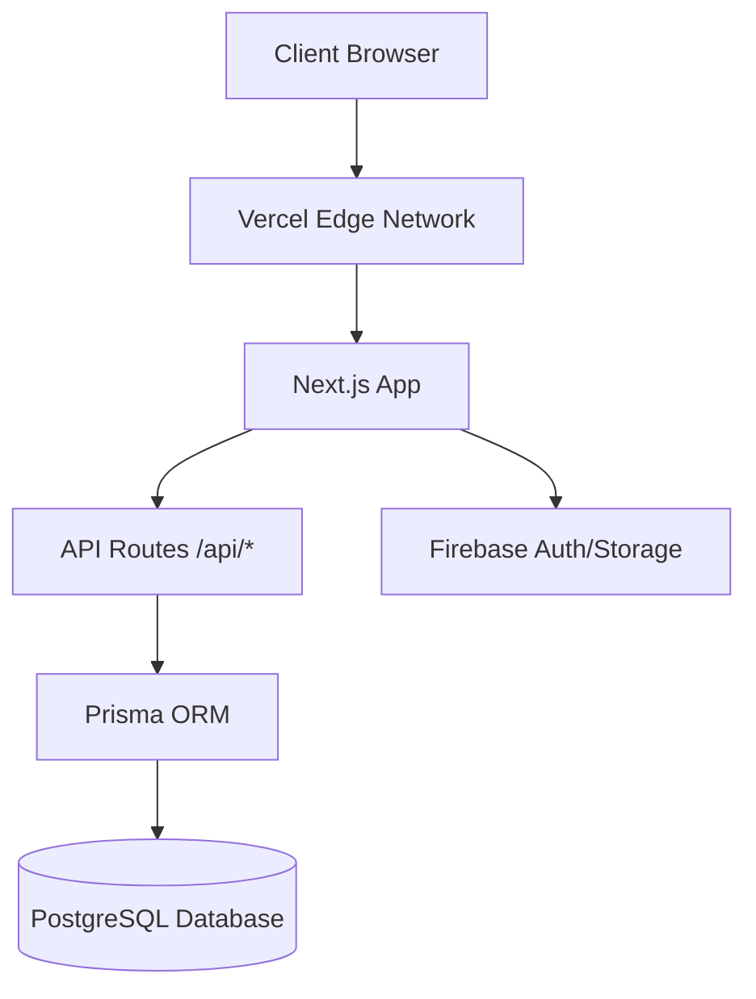

# Cultural Ambassador Award - Project Documentation

**Developer:** Yonas Mulugeta
**Project:** Cultural Ambassador Award Platform
**Version:** 1.0.0

---

## 1. Project Overview

The **Cultural Ambassador Award** platform is a modern, high-performance web application designed to recognize and elevate Ethiopia's young talents in music, performance, poetry, traditional instruments, and digital expression. The platform serves as a hub for showcasing talent, facilitating public voting, and managing the award process.

## 2. Technology Stack

This project leverages a cutting-edge stack focused on performance, scalability, and developer experience.

### **Core Framework**
- **Next.js 14 (App Router)**: The React framework for the web, providing server-side rendering, static site generation, and robust routing.
- **React 18**: The library for web and native user interfaces.
- **TypeScript**: For type safety and better developer tooling.

### **Frontend & UI**
- **Tailwind CSS**: A utility-first CSS framework for rapid UI development.
- **Shadcn/UI**: A collection of re-usable components built using Radix UI and Tailwind CSS.
- **Lucide React**: Beautiful & consistent icons.
- **Embla Carousel**: For the hero video slider.
- **Framer Motion** (Planned): For advanced animations.

### **Backend & Database**
- **Prisma ORM**: Next-generation Node.js and TypeScript ORM for type-safe database access.
- **PostgreSQL**: The primary relational database (Production).
- **SQLite**: Used for local development and testing.
- **Firebase (Legacy/Hybrid)**: Initially used for Auth and Firestore; currently being migrated to the SQL backend.
- **Next.js API Routes**: Serverless functions handling backend logic.

### **Deployment & Infrastructure**
- **Vercel**: The platform for frontend framework deployment and serverless functions.
- **Vercel Postgres**: Managed PostgreSQL database on Vercel.

## 3. System Architecture

The application follows a **Monolithic Architecture** within the Next.js ecosystem, where the frontend and backend coexist in the same repository but are logically separated.

### **High-Level Architecture Diagram**



## 4. Backend Structure

The backend is built using Next.js API Routes and Prisma ORM.

### **Database Schema**
The database is designed with the following core models:
- **User**: Stores user profiles and roles (Admin, Judge, Participant).
- **Category**: Award categories (e.g., Traditional Dance, Music).
- **Nominee**: Candidates for the awards.
- **Vote**: Records user votes with safeguards against duplicate voting.
- **Submission**: User-submitted content for consideration.
- **Popup**: Dynamic announcement system content.
- **TimelineEvent**: Events for the program timeline.
- **CulturalInsight**: Blog/Article content.

### **API Endpoints**
RESTful API routes handle data operations. Example structure:
- `/api/popups`: CRUD operations for the popup system.
- `/api/upload`: Handles file uploads to the local filesystem (or cloud storage).

## 5. Frontend Structure

The frontend is built with React components and organized by feature.

### **Key Directories**
- `src/app`: App Router pages and layouts.
    - `(admin)`: Protected admin dashboard routes.
    - `(public)`: Public-facing pages (Home, About, Nominees).
- `src/components`: Reusable UI components.
    - `ui`: Shadcn/UI primitive components.
    - `layout`: Header, Footer, Sidebar.
    - `voting`: Voting-specific components.
- `src/lib`: Utility functions, types, and database clients.

### **Key Features**
- **Dynamic Hero Section**: A video carousel showcasing cultural performances.
- **Popup System**: A flexible announcement system managed via the admin panel.
- **Voting System**: Secure and interactive voting interface.
- **Admin Dashboard**: Comprehensive management of popups, nominees, and users.

## 6. Developer Guide

### **Running Locally**

1.  **Clone the repository**:
    ```bash
    git clone <repo-url>
    cd studio
    ```

2.  **Install dependencies**:
    ```bash
    npm install
    ```

3.  **Set up Environment**:
    Create a `.env` file based on `.env.example`.

4.  **Initialize Database**:
    ```bash
    npx prisma generate
    npx prisma migrate dev --name init
    ```

5.  **Run Development Server**:
    ```bash
    npm run dev
    ```

### **Deployment**

The project is configured for seamless deployment on Vercel.
1.  Push changes to GitHub.
2.  Connect the repository to Vercel.
3.  Configure environment variables (Database URL, etc.).
4.  Deploy!


## 7. Project Structure

```
src/
├── app/                    # App Router pages and API routes
│   ├── (admin)/            # Protected admin routes
│   │   └── admin/          # Admin dashboard pages
│   ├── (auth)/             # Authentication pages (login)
│   ├── (public)/           # Public pages group
│   ├── api/                # Backend API routes
│   │   ├── popups/         # Popup management endpoints
│   │   └── upload/         # File upload endpoints
│   ├── about/              # About page
│   ├── categories/         # Award categories page
│   ├── nominees/           # Nominee profiles and listing
│   ├── globals.css         # Global styles and Tailwind directives
│   ├── layout.tsx          # Root layout with providers
│   └── page.tsx            # Home page with hero slider
├── components/             # React components
│   ├── ui/                 # Shadcn/UI primitive components
│   ├── layout/             # Site header, footer, sidebar
│   ├── voting/             # Voting system components
│   └── announcement-popup.tsx # Dynamic popup component
├── lib/                    # Utilities and libraries
│   ├── prisma.ts           # Prisma client instance
│   ├── api-utils.ts        # API helpers (response, error handling)
│   └── utils.ts            # General utility functions
├── firebase/               # Firebase configuration (Legacy)
└── hooks/                  # Custom React hooks
```

---

**© 2025 Cultural Ambassador Award. Developed by Yonas Mulugeta.**
