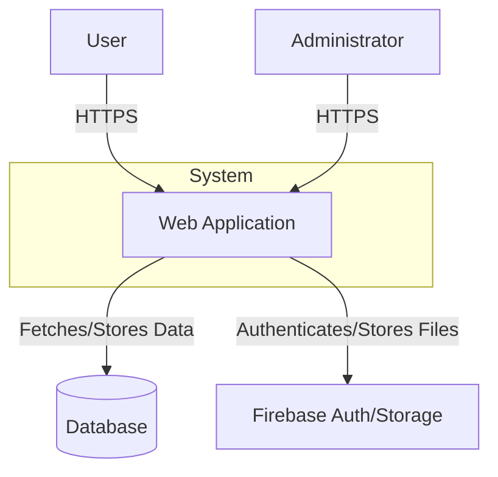
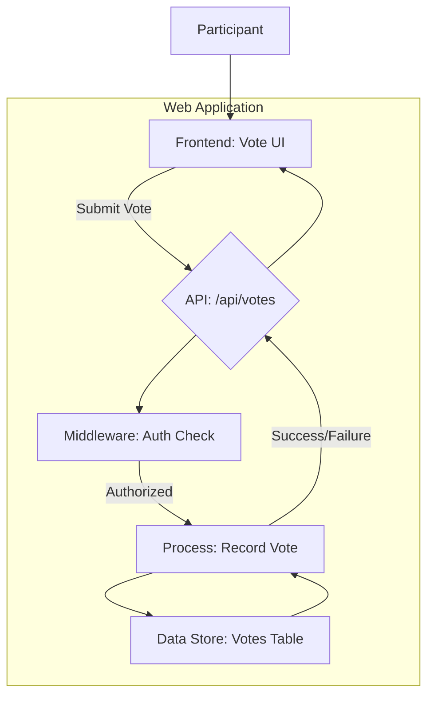
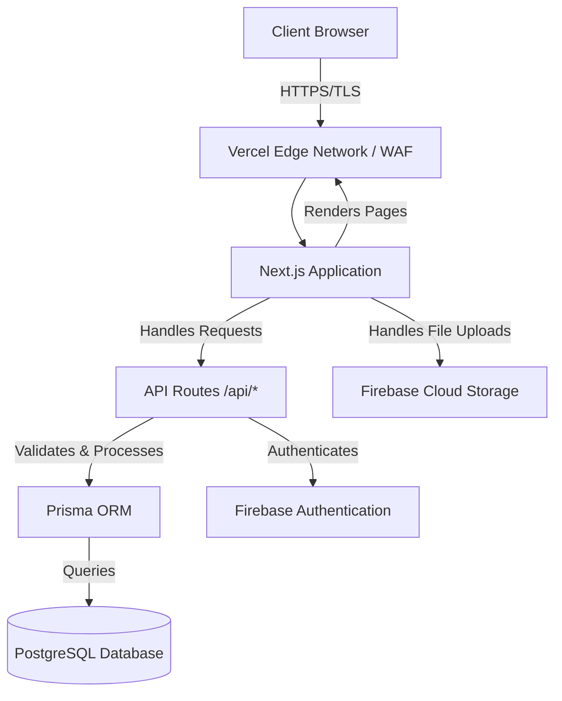
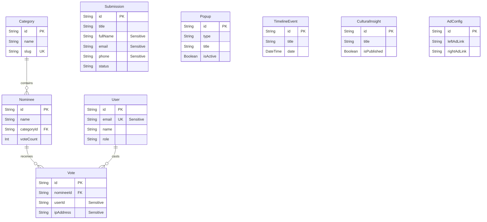

# Web Application Security Audit Documentation

This document provides the technical details required for the web application security audit, as specified by the Information Network Security Administration (INSA).

## 4.2 Technical Documentation for Web Application Security Testing

### 4.2.1 Business Architecture and Design

#### a) Data Flow Diagram (DFD)

The following diagram illustrates the high-level data flow within the application.

**Context-Level DFD (Level 0)**


**Detailed DFD (Level 1 - Example: Voting Process)**


#### b) System Architecture Diagram

The application is deployed on Vercel, leveraging its serverless infrastructure.

**Deployment & Component Architecture**

**Security Layers:**
- **Transport Layer:** All traffic is encrypted using HTTPS/TLS, enforced by Vercel.
- **Web Application Firewall (WAF):** Vercel provides built-in WAF and DDoS protection.
- **Authentication:** Handled via Firebase Authentication (JWT-based).
- **Authorization:** Role-Based Access Control (RBAC) is implemented in the API routes.

#### c) Entity Relationship Diagram (ERD)

The following diagram illustrates the database schema. Sensitive fields are marked for review.



### 4.2.2 Features of the Web Application

- **Development Framework:** Next.js (React)
- **Libraries & Plugins:** Prisma (ORM), Tailwind CSS, ShadCN UI, Genkit (AI)
- **Custom Modules:** Custom API routes for data handling, voting logic, and admin functionalities.
- **Third-Party Integrations:** Firebase (Authentication, Storage), Vercel (Hosting), Google Genkit.
- **Actor/User Types:** `admin`, `judge`, `participant`.
- **System Dependencies:** Node.js, PostgreSQL.
- **Existing Security Infrastructure:** Vercel WAF, Firebase Security Rules.

### 4.2.3 Define Specific Testing Scope (Mandatory)

| Asset Name          | URL/IP Address                  | Test Account Credentials     |
| ------------------- | ------------------------------- | ---------------------------- |
| Public Web Portal   | `[Your Domain]`                 | `participant@example.com` / `password123` |
| Admin Portal        | `[Your Domain]/admin`           | `admin@example.com` / `password123`       |

### 4.2.4 Security Functionality Document

- **User Roles & Access Control:** RBAC is implemented using a `role` field on the `User` model. API endpoints are protected by middleware that checks the user's role.
- **Input Validation:** Zod is used for schema validation on API request bodies to prevent malformed data. Prisma ORM provides protection against SQL injection.
- **Session Management:** JWTs are issued by Firebase Auth. Sessions have a defined expiration time. Secure, HTTP-only cookies should be configured.
- **Error Handling:** API routes use `try...catch` blocks to prevent unhandled exceptions and return standardized error responses.
- **Secure Communications:** TLS is enforced by the Vercel hosting platform for all connections.

### 4.2.5 Secure Coding Standard Documentation

- **Guidelines:** The project aims to follow OWASP Secure Coding Practices.
- **SQL Injection:** Prevented by exclusively using the Prisma ORM for database access, which sanitizes inputs.
- **Cross-Site Scripting (XSS):** React/Next.js inherently protects against XSS by escaping content rendered in JSX.
- **Authentication & Session Management:** Handled by Firebase Authentication, a secure and robust third-party service.
- **Dependency Management:** `npm audit` is used to identify and patch vulnerable dependencies.

### 4.2.6 Functional Requirements

- **Core Workflows:** User Registration/Login, Profile Management, Submissions, Voting, Admin Dashboard for management of users, categories, and nominees.
- **API Endpoints:** A full list of API endpoints is provided in section `5.4.4`.
- **Role-Based Access:**
  - **participant:** Can vote, submit nominations, and view public content.
  - **admin:** Has full CRUD access to all data via the `/admin` portal.

### 4.2.7 Non-Functional Requirements

- **Performance:** Deployed on Vercel's Edge Network for low-latency responses globally.
- **Availability:** High uptime is guaranteed by Vercel's serverless infrastructure.
- **Scalability:** The serverless architecture scales automatically with traffic. The database is a managed service that can be scaled as needed.
- **Reliability:** Automated backups and disaster recovery are managed by the database provider.
- **Security:** Follows a defense-in-depth approach, including a WAF, secure coding, and third-party auth.

### 4.2.8 Threat Modeling

| Threat (STRIDE) | Description | Mitigation Strategy |
| --------------- | ----------- | ------------------- |
| **Spoofing** | An attacker impersonates a legitimate user. | Strong password policies, JWT-based authentication (Firebase Auth). |
| **Tampering** | An attacker modifies data in transit or at rest. | TLS encryption for data in transit, checksums for file uploads, database-level constraints. |
| **Repudiation** | A user denies performing an action. | Comprehensive audit logging for critical actions (e.g., votes, payments). |
| **Information Disclosure** | Sensitive data is exposed to unauthorized users. | Strict RBAC on API endpoints, ERD identifies sensitive data for encryption, minimal data exposure in API responses. |
| **Denial of Service** | The application becomes unavailable to legitimate users. | Vercel's built-in DDoS protection, rate limiting on critical API endpoints. |
| **Elevation of Privilege** | A user gains access to admin-level functionalities. | Strict RBAC middleware on all admin-only API routes. |

### 4.2.9 Previous Security Testing Reports

No previous security audits have been conducted. This is the first official assessment.

## 5. API Security Audit Requirements

### 5.4.1 Request/Response File

**Example: Successful Vote (Request)**
```json
POST /api/votes
{
  "nomineeId": "clyu1z2a0000008l4g1j2h3k4"
}
```
**Example: Successful Vote (Response)**
```json
{
  "success": true,
  "message": "Vote cast successfully"
}
```
**Example: Failed Vote (Response)**
```json
{
  "success": false,
  "error": "You have already voted for this nominee"
}
```

### 5.4.2 Updated API Documentation

All API logic is contained within the `src/app/api/` directory. Each sub-directory corresponds to a resource and contains a `route.ts` file that defines the handlers for different HTTP methods (`GET`, `POST`, `PUT`, `DELETE`).

### 5.4.3 API Types

- **Type:** REST
- **Data Format:** JSON

### 5.4.4 API Endpoints and Functionality

| Endpoint | HTTP Method | Description | Access |
|---|---|---|---|
| `/api/categories` | GET, POST | Manage categories | Admin |
| `/api/categories/[id]` | GET, PUT, DELETE | Manage a single category | Admin |
| `/api/nominees` | GET, POST | Manage nominees | Admin |
| `/api/nominees/[id]` | GET, PUT, DELETE | Manage a single nominee | Admin |
| `/api/submissions` | GET, POST | Manage submissions | Admin |
| `/api/submissions/[id]` | GET, PUT, DELETE | Manage a single submission | Admin |
| `/api/votes` | POST | Cast a vote | Participant |
| `/api/admin/stats` | GET | Retrieve dashboard statistics | Admin |
| `/api/admin/participants` | GET | List all participants | Admin |

### 5.4.5 Authentication Mechanism

- **Mechanism:** JWT (JSON Web Tokens) managed by **Firebase Authentication**.
- **Lifecycle:** Tokens are obtained upon login and refreshed automatically by the Firebase SDK. They are validated on the backend using the Firebase Admin SDK.

### 5.4.6 Third-Party Integrations

- **Firebase:** Used for user authentication and file storage. Security is managed via Firebase Security Rules.
- **Vercel:** Hosting platform with integrated security features (WAF, DDoS protection).

### 5.4.7 Compliance and Regulatory Requirements

To be determined based on project and regional requirements.

### 5.4.8 Authorization and Access Control

- **Model:** Role-Based Access Control (RBAC) and Attribute-Based Access Control (ABAC).
- **Implementation:** A middleware (`src/middleware.ts`) inspects the user's role from their JWT and protects API routes. For example, any route under `/api/admin/*` requires the `admin` role.

### 5.4.9 Test Account

A dedicated test account with multiple privilege levels will be provided upon request.
- `admin@example.com` (Admin)
- `participant@example.com` (Participant)

## 6. Contact Information and Communication

| Name | Role | Email Address | Phone Number |
|---|---|---|---|
| [Name] | Project Manager | [Email] | [Phone] |
| [Name] | Lead Developer | [Email] | [Phone] |
