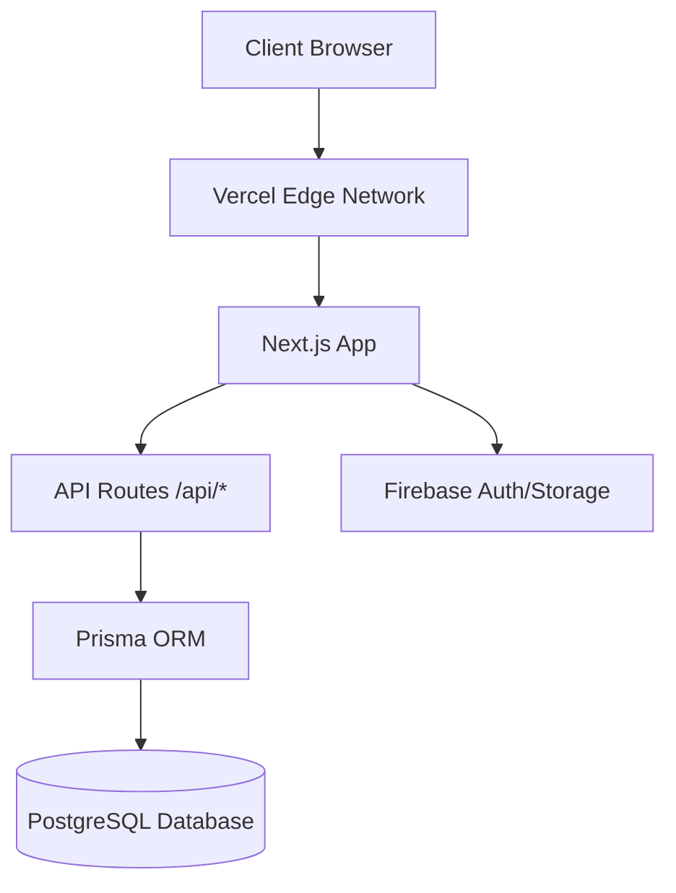

# Cultural Ambassador Award - Project Documentation

**Developer:** Yonas Mulugeta
**Project:** Cultural Ambassador Award Platform
**Version:** 1.0.0

---

## 1. Project Overview

The **Cultural Ambassador Award** platform is a modern, high-performance web application designed to recognize and elevate Ethiopia's young talents in music, performance, poetry, traditional instruments, and digital expression. The platform serves as a hub for showcasing talent, facilitating public voting, and managing the award process.

## 2. Technology Stack

This project leverages a cutting-edge stack focused on performance, scalability, and developer experience.

### **Core Framework**
- **Next.js 14 (App Router)**: The React framework for the web, providing server-side rendering, static site generation, and robust routing.
- **React 18**: The library for web and native user interfaces.
- **TypeScript**: For type safety and better developer tooling.

### **Frontend & UI**
- **Tailwind CSS**: A utility-first CSS framework for rapid UI development.
- **Shadcn/UI**: A collection of re-usable components built using Radix UI and Tailwind CSS.
- **Lucide React**: Beautiful & consistent icons.
- **Embla Carousel**: For the hero video slider.
- **Framer Motion** (Planned): For advanced animations.

### **Backend & Database**
- **Prisma ORM**: Next-generation Node.js and TypeScript ORM for type-safe database access.
- **PostgreSQL**: The primary relational database (Production).
- **SQLite**: Used for local development and testing.
- **Firebase (Legacy/Hybrid)**: Initially used for Auth and Firestore; currently being migrated to the SQL backend.
- **Next.js API Routes**: Serverless functions handling backend logic.

### **Deployment & Infrastructure**
- **Vercel**: The platform for frontend framework deployment and serverless functions.
- **Vercel Postgres**: Managed PostgreSQL database on Vercel.

## 3. System Architecture

The application follows a **Monolithic Architecture** within the Next.js ecosystem, where the frontend and backend coexist in the same repository but are logically separated.

### **High-Level Architecture Diagram**



## 4. Backend Structure

The backend is built using Next.js API Routes and Prisma ORM.

### **Database Schema**
The database is designed with the following core models:
- **User**: Stores user profiles and roles (Admin, Judge, Participant).
- **Category**: Award categories (e.g., Traditional Dance, Music).
- **Nominee**: Candidates for the awards.
- **Vote**: Records user votes with safeguards against duplicate voting.
- **Submission**: User-submitted content for consideration.
- **Popup**: Dynamic announcement system content.
- **TimelineEvent**: Events for the program timeline.
- **CulturalInsight**: Blog/Article content.

### **API Endpoints**
RESTful API routes handle data operations. Example structure:
- `/api/popups`: CRUD operations for the popup system.
- `/api/upload`: Handles file uploads to the local filesystem (or cloud storage).

## 5. Frontend Structure

The frontend is built with React components and organized by feature.

### **Key Directories**
- `src/app`: App Router pages and layouts.
    - `(admin)`: Protected admin dashboard routes.
    - `(public)`: Public-facing pages (Home, About, Nominees).
- `src/components`: Reusable UI components.
    - `ui`: Shadcn/UI primitive components.
    - `layout`: Header, Footer, Sidebar.
    - `voting`: Voting-specific components.
- `src/lib`: Utility functions, types, and database clients.

### **Key Features**
- **Dynamic Hero Section**: A video carousel showcasing cultural performances.
- **Popup System**: A flexible announcement system managed via the admin panel.
- **Voting System**: Secure and interactive voting interface.
- **Admin Dashboard**: Comprehensive management of popups, nominees, and users.

## 6. Developer Guide

### **Running Locally**

1.  **Clone the repository**:
    ```bash
    git clone <repo-url>
    cd studio
    ```

2.  **Install dependencies**:
    ```bash
    npm install
    ```

3.  **Set up Environment**:
    Create a `.env` file based on `.env.example`.

4.  **Initialize Database**:
    ```bash
    npx prisma generate
    npx prisma migrate dev --name init
    ```

5.  **Run Development Server**:
    ```bash
    npm run dev
    ```

### **Deployment**

The project is configured for seamless deployment on Vercel.
1.  Push changes to GitHub.
2.  Connect the repository to Vercel.
3.  Configure environment variables (Database URL, etc.).
4.  Deploy!


## 7. Project Structure

```
src/
├── app/                    # App Router pages and API routes
│   ├── (admin)/            # Protected admin routes
│   │   └── admin/          # Admin dashboard pages
│   ├── (auth)/             # Authentication pages (login)
│   ├── (public)/           # Public pages group
│   ├── api/                # Backend API routes
│   │   ├── popups/         # Popup management endpoints
│   │   └── upload/         # File upload endpoints
│   ├── about/              # About page
│   ├── categories/         # Award categories page
│   ├── nominees/           # Nominee profiles and listing
│   ├── globals.css         # Global styles and Tailwind directives
│   ├── layout.tsx          # Root layout with providers
│   └── page.tsx            # Home page with hero slider
├── components/             # React components
│   ├── ui/                 # Shadcn/UI primitive components
│   ├── layout/             # Site header, footer, sidebar
│   ├── voting/             # Voting system components
│   └── announcement-popup.tsx # Dynamic popup component
├── lib/                    # Utilities and libraries
│   ├── prisma.ts           # Prisma client instance
│   ├── api-utils.ts        # API helpers (response, error handling)
│   └── utils.ts            # General utility functions
├── firebase/               # Firebase configuration (Legacy)
└── hooks/                  # Custom React hooks
```


## 8. Project Progress & Status

### **🎯 Overall Progress: ~75% Complete**

The Cultural Ambassador Award platform is in advanced development with most core features implemented and functional. The application is ready for testing and refinement.

---

### **✅ Completed Features**

#### **Frontend (Public-Facing)**
- ✅ **Homepage** with dynamic hero video carousel using Embla Carousel
- ✅ **About Page** with mission, vision, and cultural context
- ✅ **Categories Page** displaying all award categories with images and descriptions
- ✅ **Nominees Page** with filtering by category and search functionality
- ✅ **Individual Nominee Profiles** with bio, media (images/videos), and voting interface
- ✅ **Voting System** with fingerprint-based duplicate prevention
- ✅ **Submission Portal** for participants to submit their work
- ✅ **Cultural Insights** blog/article section
- ✅ **Contact Page** with form submission
- ✅ **Voting Rules Page** explaining the voting process
- ✅ **Privacy Policy Page**
- ✅ **Dynamic Popup System** for announcements (video, image, text)
- ✅ **Responsive Design** optimized for mobile, tablet, and desktop
- ✅ **SEO Optimization** with proper meta tags and semantic HTML

#### **Backend & API**
- ✅ **Database Schema** with 8 core models (User, Category, Nominee, Vote, Submission, Popup, TimelineEvent, CulturalInsight)
- ✅ **Prisma ORM** integration with SQLite (dev) and PostgreSQL (production)
- ✅ **RESTful API Endpoints**:
  - `/api/categories` - Category management
  - `/api/nominees` - Nominee CRUD operations
  - `/api/votes` - Public voting with rate limiting
  - `/api/votes/[nomineeId]` - Vote count retrieval
  - `/api/submissions` - Public submission handling
  - `/api/popups` - Dynamic popup management
  - `/api/upload` - File upload to local filesystem
  - `/api/admin/stats` - Analytics and statistics
- ✅ **Authentication System** using Firebase Auth (admin-only)
- ✅ **File Upload System** with local storage support
- ✅ **Vote Protection** using IP address and browser fingerprinting
- ✅ **Database Seeding** scripts for initial data

#### **Admin Dashboard**
- ✅ **Admin Authentication** with protected routes
- ✅ **Dashboard Overview** with key statistics and analytics
- ✅ **Category Management** (Create, Edit, Delete, Reorder)
- ✅ **Nominee Management** (Create, Edit, Delete, Feature nominees)
- ✅ **Submission Review** (View, Approve, Reject submissions)
- ✅ **Popup Management** (Create video/image/text popups)
- ✅ **Analytics Dashboard** with charts using Recharts
- ✅ **Participant Management** (View submission history)
- ✅ **Cultural Insights Management** (Create, Edit, Publish articles)
- ✅ **Settings Panel** for system configuration

#### **AI Integration**
- ✅ **Google Genkit AI** integration for content suggestions
- ✅ **AI-Powered Judge Assistance** for submission evaluation
- ✅ **Content Enrichment** tools for judges

---

### **🚧 In Progress / Needs Refinement**

#### **High Priority**
- 🔄 **Judge Portal** - Partially implemented, needs:
  - Scoring interface for submissions
  - Qualitative feedback system
  - Assignment management
- 🔄 **Real-time Leaderboards** - Vote counts update, but needs live refresh
- 🔄 **Advanced Analytics** - Basic stats implemented, needs deeper insights
- 🔄 **Email Notifications** - System not yet implemented
- 🔄 **Vote Fraud Detection** - Basic IP/fingerprint protection in place, needs advanced detection

#### **Medium Priority**
- 🔄 **Submission Status Tracking** - Backend ready, frontend dashboard needed
- 🔄 **Round Management** - Database schema supports it, admin UI needed
- 🔄 **Regional Filtering** - Not yet implemented
- 🔄 **Social Sharing** - Share buttons present but need proper integration
- 🔄 **Performance Optimization** - Image optimization, lazy loading, caching

#### **Low Priority**
- 🔄 **Multi-language Support** - Not yet implemented (Amharic/English)
- 🔄 **Dark Mode** - Not yet implemented
- 🔄 **Advanced Search** - Basic search works, needs fuzzy matching and filters
- 🔄 **Sponsor Management** - Mentioned in blueprint, not yet built

---

### **📊 Feature Completion Breakdown**

| **Component**              | **Progress** | **Status**          |
|----------------------------|--------------|---------------------|
| Public Website             | 90%          | ✅ Mostly Complete  |
| Voting System              | 85%          | ✅ Functional       |
| Submission Portal          | 80%          | ✅ Functional       |
| Admin Dashboard            | 85%          | ✅ Functional       |
| Judge Portal               | 40%          | 🚧 In Progress      |
| Analytics & Reporting      | 60%          | 🚧 In Progress      |
| AI Content Enrichment      | 70%          | ✅ Functional       |
| Email & Notifications      | 0%           | ❌ Not Started      |
| Testing & QA               | 30%          | 🚧 In Progress      |
| Documentation              | 75%          | ✅ Good             |

---

### **🎨 Design & UX Status**

- ✅ **Modern UI** with Tailwind CSS and Shadcn/UI components
- ✅ **Ethiopian Cultural Aesthetics** with traditional patterns and colors
- ✅ **Mobile-First Responsive Design**
- ✅ **Accessible Components** using Radix UI primitives
- ✅ **Smooth Animations** with CSS transitions
- 🔄 **Micro-interactions** - Partially implemented
- 🔄 **Loading States** - Some components need skeleton loaders

---

### **🔐 Security & Performance**

#### **Implemented**
- ✅ IP-based rate limiting for votes
- ✅ Browser fingerprinting for duplicate vote prevention
- ✅ Admin route protection with middleware
- ✅ Input validation using Zod schemas
- ✅ SQL injection protection via Prisma ORM
- ✅ Environment variable management

#### **Needs Work**
- 🔄 CSRF protection
- 🔄 Rate limiting on API endpoints
- 🔄 Image optimization and CDN integration
- 🔄 Database query optimization
- 🔄 Caching strategy (Redis/Vercel KV)

---

### **📱 Platform Compatibility**

- ✅ **Desktop Browsers**: Chrome, Firefox, Safari, Edge
- ✅ **Mobile Browsers**: iOS Safari, Chrome Mobile, Samsung Internet
- ✅ **Tablet**: iPad, Android tablets
- ✅ **Screen Sizes**: 320px to 4K displays

---

### **🚀 Deployment Status**

- ✅ **Vercel Configuration** ready
- ✅ **Environment Variables** documented
- ✅ **Database Migrations** working
- ✅ **Build Process** optimized
- 🔄 **Production Database** - Needs PostgreSQL setup on Vercel
- 🔄 **Domain Configuration** - Pending
- 🔄 **SSL Certificate** - Handled by Vercel
- 🔄 **CDN Setup** - For static assets

---

### **📋 Next Steps (Recommended Priority)**

1. **Complete Judge Portal** (High Impact)
   - Build scoring interface
   - Implement feedback system
   - Add submission assignment logic

2. **Implement Email Notifications** (High Impact)
   - Submission confirmations
   - Status updates
   - Winner announcements

3. **Advanced Vote Fraud Detection** (High Priority)
   - Pattern analysis
   - Velocity checks
   - Admin flagging system

4. **Performance Optimization** (Medium Priority)
   - Image optimization with Next.js Image
   - Implement caching strategy
   - Database query optimization

5. **Testing & QA** (High Priority)
   - Unit tests for API routes
   - Integration tests for voting flow
   - E2E tests for critical paths
   - Load testing for voting surge

6. **Production Deployment** (High Priority)
   - Set up Vercel Postgres
   - Configure environment variables
   - Run database migrations
   - Deploy to production

---

### **🐛 Known Issues**

- Minor UI inconsistencies on some mobile devices
- Vote count refresh requires page reload
- File upload size limits not enforced on frontend
- Some admin forms lack proper error handling

---

### **📈 Technical Debt**

- Firebase integration is hybrid (Auth only) - consider full migration to NextAuth
- Some components need refactoring for better reusability
- API error handling could be more consistent
- Need to add comprehensive logging system

---

## 9. Changelog

- **2025-12-03**: Added comprehensive project progress documentation
    - Documented all completed features across frontend, backend, and admin
    - Identified in-progress work and prioritized next steps
    - Added feature completion breakdown and technical status
    
- **2025-12-01**: Refactored authentication
    - Admin-only login/logout retained; public "Log In/Sign Up" removed from header
    - Updated Prisma schema for public voting and submissions (IP/fingerprint, contact fields)
    - Implemented public `/api/votes` and `/api/submissions` endpoints

---

**© 2025 Cultural Ambassador Award. Developed by Yonas Mulugeta.**
