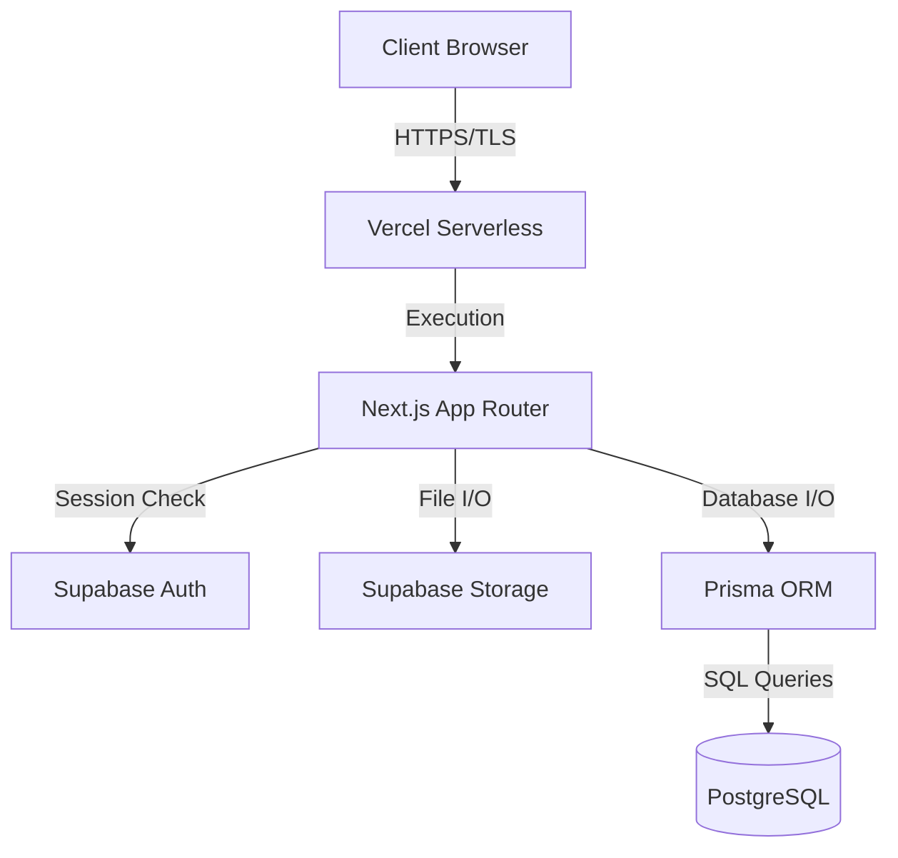
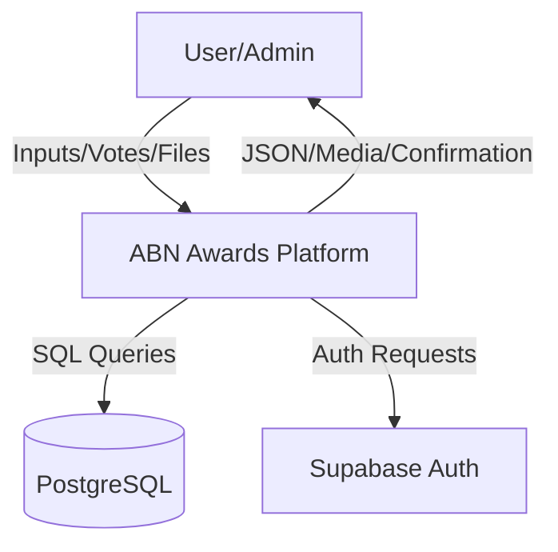
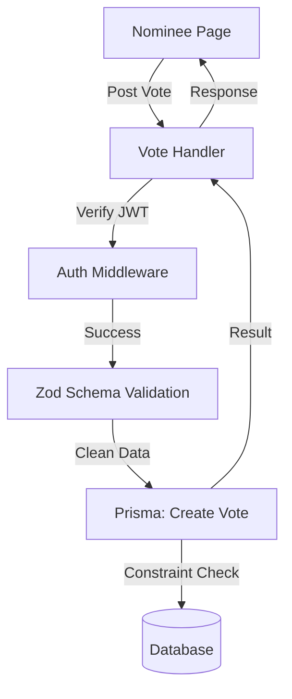

# Software Requirements Specification (SRS) - Security Audit

## 1. System Scope
The **Cultural Ambassador Award** platform is a full-stack web application designed to manage the nomination, review, and voting process for Ethiopian cultural excellence awards. 

The scope of this security audit covers:
- **Frontend/Backend**: Next.js 15 App Router (deployed on Vercel).
- **Database**: PostgreSQL managed via Prisma ORM.
- **Authentication**: Supabase Auth (JWT-based session management).
- **Storage**: Supabase Storage for media assets.
- **AI Infrastructure**: Google Genkit for cultural content generation.
- **Monitoring**: Sentry for error tracking and performance monitoring.

---

## 2. System Functionality

### 2.1 Participant Module
- **Public Voting**: Authenticated users can cast one vote per nominee per category.
- **Profile Management**: Users can update their personal information and view their voting history.
- **Nominee Discovery**: Users can browse nominees by category, region, or featured status.
- **Cultural Insights**: Access to educational articles and blog posts about Ethiopian heritage.

### 2.2 Nomination Module
- **Public Submissions**: Users can submit nominations including text descriptions and media files.
- **Submission Tracking**: Submitters can view the status of their nomination (Pending, Approved, Rejected).

### 2.3 Admin Module
- **Content Management**: Full CRUD operations for Categories, Nominees, and Media.
- **Review Workflow**: Administrators review public submissions and either reject them or promote them to official nominees.
- **Security Management**: Management of user roles and access controls.
- **Marketing Controls**: Configuration of site-wide popups and sidebar advertisements.

### 2.4 AI & Insights Module
- **AI Suggestions**: Automated suggestions for cultural descriptions and metadata (Genkit).

---

## 3. User Roles and Responsibilities

| Role | Responsibilities | Access Level |
| :--- | :--- | :--- |
| **Participant** | Browse, Vote, and submit nominations. | Authenticated User |

| **Administrator** | Full system control, role management, analytics, content moderation. | Full Admin (RBAC) |
| **Public User** | Browse nominees and categories. | Anonymous/ReadOnly |

---

## 4. System Architecture

### 4.1 Architecture Overview
The system follows a modern decoupled architecture:
1.  **Client Tier**: React-based frontend using Tailwind CSS and ShadCN UI.
2.  **Logic Tier**: Next.js Serverless Functions (API routes) executing in Node.js.
3.  **Identity Tier**: Supabase Auth providing JWT tokens for session persistence.
4.  **Data Tier**: PostgreSQL database for structured data and Supabase Storage for binary media files.

### 4.2 Architecture Diagram

---

## 5. Data Flow Diagrams (DFD)

### 5.1 Context-Level DFD (Level 0)

### 5.2 Detailed DFD (Level 1 - Voting Flow)

---

## 6. Applicable Security Frameworks

The platform's security design is informed by the following frameworks:
- **OWASP Top 10**: Mitigations implemented for SQLi (Prisma), XSS (JSX sanitization), and Broken Access Control (server-side RBAC).
- **Supabase Security Best Practices**: Use of JWT, secure cookie management, and service role isolation.
- **Vercel Infrastructure Standards**: TLS 1.3 encryption, automatic SSL/TLS, and WAF protection.
- **GDPR/Data Privacy**: PII minimization and secure hashing of sensitive user identifiers.

---

## 7. Threat Models (STRIDE)

| Threat | Strategy | Implementation |
| :--- | :--- | :--- |
| **Spoofing** | Authentication | Supabase JWT & Session hooks. |
| **Tampering** | Integrity | Zod Schema Validation & TLS Encryption. |
| **Repudiation** | Non-repudiation | Audit logs for votes and submissions. |
| **Information Disclosure** | Confidentiality | RBAC controls & Database field filtering. |
| **Denial of Service** | Availability | Vercel Edge protection & Scale-on-demand. |
| **Elevation of Privilege**| Authorization | Server-side `requireAdmin` middleware. |
| **AI Data Leakage** | Content Security | Genkit validation and restricted model context. |

---

## 9. Data Integrity and Recovery
To ensure high availability and data persistence, the platform employs:
- **Automated Backups**: Supabase provides daily PostgreSQL backups with point-in-time recovery (PITR) capabilities.
- **Transactional Integrity**: Prisma ORM ensures that all database operations (e.g., casting a vote and updating the nominee's count) are transactional, preventing partial data updates.
- **Asset Redundancy**: Media files in Supabase Storage are replicated across multiple availability zones.

## 10. Compliance and Standards
The system architecture and development process adhere to:
- **Secure SDLC**: Code reviews and automated linting for every release.
- **PII Protection**: Encryption of personally identifiable information during transit and at rest.
- **Least Privilege Access**: Admin roles are granted only to specific identifiers (`yoni.win.yw@gmail.com`).

---

## 11. Verification & Compliance
This document is prepared to meet the compliance requirements for the **INSA Web Application Security Audit**. All functionalities described are currently implemented and under continuous monitoring.

**Project Lead:** Yonas Mulugeta
**Last Updated:** December 2025
