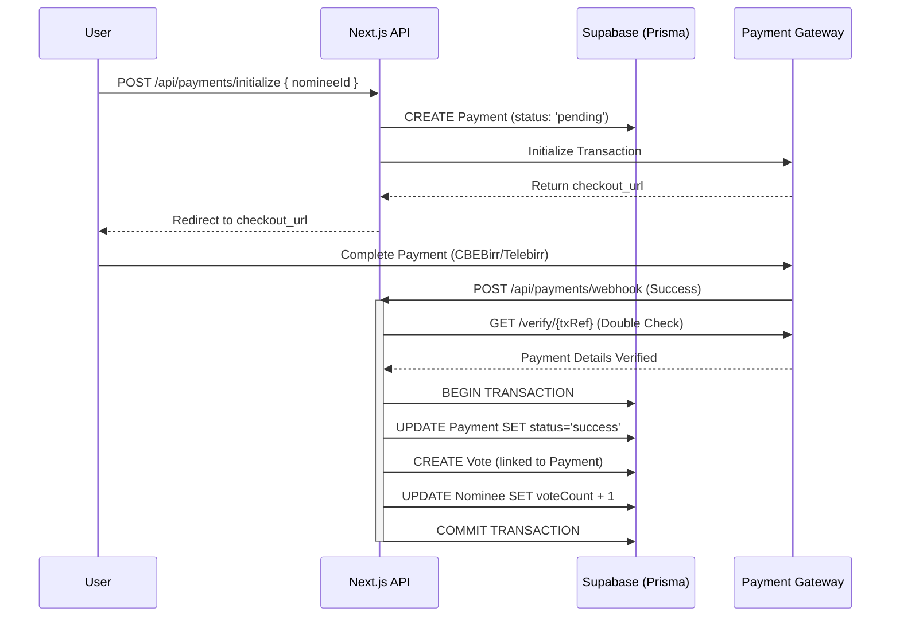

# Payment & Voting System Documentation (Unified)

**Document Name:** Payment, Voting & Requirements Master Guide
**Version:** 2.1 (Unified)
**Date:** 2026-02-03
**Scope:** Voting Logic, Payment Gateway Integration (Chapa/CBEBirr), Security Specifications.

---

## 1. Executive Summary

This document serves as the **Master Software Requirements Specification (SRS)** and **System Design Review (SDR)** for the paid voting module of the Studio Awards Platform. It combines technical implementation details with formal business requirements.

The system has shifted from a free-voting model to a **Payment-Gated Voting System**. Votes are no longer created directly by the user; instead, they are generated system-side *only* after a unified payment gateway (Chapa, supporting CBEBirr/Telebirr) confirms a successful transaction. This ensures high integrity, eliminates botting, and provides a verified revenue stream.

---

## 2. Functional Requirements (FRS)

### 2.1 Voting & Payment Flow
- **FR-PAY-01 (Initialization):** The system shall allow users to initiate a vote transaction for a specific nominee.
  - **Input:** `nomineeId`, `amount` (e.g., 10 ETB), `payer_info` (optional).
  - **Output:** A secure `checkoutUrl` from the payment gateway.
- **FR-PAY-02 (Verification):** The system must verify the transaction status asynchronously via a Webhook.
- **FR-PAY-03 (Vote Creation):** A `Vote` record must **only** be created upon receipt of a successful payment event.
  - **Constraint:** One valid payment = One Vote.
- **FR-PAY-04 (Idempotency):** The webhook handler must be idempotent; receiving the same success notification twice must not create duplicate votes.
- **FR-V-05 (Payment Integration):** The system shall integrate with the **CBEBirr API** for payment processing.
  - **Constraint:** Votes must **only** be counted after a successful "Job Done" / "Payment Received" confirmation from CBEBirr.

### 2.2 Payment Gateway Support
- **Gateway:** Chapa (Aggregator).
- **Supported Methods:** CBEBirr, Telebirr, Cards.
- **Currency:** ETB.

---

## 3. Non-Functional Requirements (NFR)

- **NFR-SEC-01 (Transactional Integrity):** Database updates (Payment Status + Vote Creation + Counter Increment) must occur within a single atomic database transaction.
- **NFR-SEC-02 (Auditability):** Every vote must be traceable to a specific, verified content provider transaction reference (`txRef`).
- **NFR-REL-01 (Webhook Reliability):** The system must handle payment gateway timeouts and retries gracefully.
- **NFR-PERF-01 (Latency):** Voting API endpoints should respond within **200ms** (excluding payment gateway latency).
- **NFR-COM-01 (Scoring Rules):** The final winner calculation must support a weighted average: **70% Public Vote** + **30% Jury Score**.

---

## 4. System Architecture

### 4.1 Technology Stack
- **Frontend:** Next.js 15 (App Router).
- **Backend:** Next.js Route Handlers (`/app/api`).
- **Database:** PostgreSQL (via Supabase).
- **ORM:** Prisma Client.
- **Payment Gateway:** CBEBirr API (via Chapa).

### 4.2 Application Flow Diagram


---

## 5. System Actors & Access Control

| Actor | Description | Access Level |
| :--- | :--- | :--- |
| **Guest (Voter)** | Public user visiting the site. | **Read-Only:** Nominees.<br>**Write:** Vote (Paid, 1/transaction). |
| **System (Payment)**| CBEBirr Payment Gateway. | **Write:** Payment Confirmation Callbacks. |
| **Admin** | System operator. | **Read:** Vote Logs, Payment Records. |

---

## 6. How the Code Works (Deep Dive)

### 6.1 Database Schema (The Foundation)
The strict link between voting and payments is enforced at the database level:
```prisma
// prisma/schema.prisma

model Vote {
  id          String   @id @default(uuid())
  nomineeId   String
  // CRITICAL: Linking vote to a specific verified payment
  paymentId   String   @unique 
  payment     Payment  @relation(fields: [paymentId], references: [id])
}

model Payment {
  id          String   @id @default(uuid())
  txRef       String   @unique
  status      String   @default("pending") // pending -> success
  vote        Vote?    // One-to-one relation
}
```

### 6.2 Initialization (`src/app/api/payments/initialize/route.ts`)
This component is the entry point. It **does not create a vote**.
1.  **Validates** the nominee exists and is active.
2.  **Generates** a unique `txRef`.
3.  **Calls Chapa** to get the checkout page.
4.  **Records** the intent in the `Payment` table with `status: 'pending'`.

### 6.3 verification & Vote Logic (`src/app/api/payments/webhook/route.ts`)
This is the **Core Logic** where the actual voting compliance happens.
1.  **Receives** the webhook payload `(txRef, status)`.
2.  **Verifies** the transaction explicitly with Chapa API (Security Check against spoofed webhooks).
3.  **Atomic Transaction (`prisma.$transaction`)**:
    *   Legacy or loose systems might fail here, but this code ensures consistency.
    *   Updates `Payment` to `success`.
    *   **Creates the `Vote` record.**
    *   **Increments `Nominee.voteCount`.**
    *   If *any* step fails, the entire operation rolls back, preventing "Ghost Votes" (votes without payments) or "Lost Money" (payments without votes).

### 6.4 Anti-Fraud Measures
Even with paid voting, fraud protection exists:
*   **Idempotency:** The webhook checks `if (payment.vote)` before proceeding. If Chapa sends the same webhook 5 times, only 1 vote counts.
*   **Fingerprinting:** Browser fingerprints are captured during initialization and stored with the payment/vote record to detect if one user is funding thousands of votes (potential money laundering or specialized manipulation).

---

## 7. Security & Threat Model

### 7.1 Mitigations
- **Vote Manipulation:**
  - **Mitigation:**
    - **Payment Gating:** Effectively prevents mass-botting by requiring financial transaction per vote.
    - **Fingerprinting:** Browser fingerprinting to detect clearing cookies/incognito.
- **Injection Attacks:**
  - **Mitigation:** Prisma ORM fully parameterizes queries, preventing SQL injection.
- **Data Validation:**
  - **Mitigation:** Zod schemas in every API route validate structure, types, and constraints (e.g., `paymentToken` format).

---

## 8. Recommendations & Next Steps Review

1.  **Legacy Code Removal:** `src/app/api/votes/route.ts` has been deleted to enforce the paid voting flow.
2.  **UI Feedback:** Frontend polls for payment status and handles the redirect callback (`/payment/callback`) to show the "Thank You" animation.
3.  **CBEBirr Specifics:** UI explicitly shows "Pay with CBEBirr" instructions via clear labels in the payment modal.
