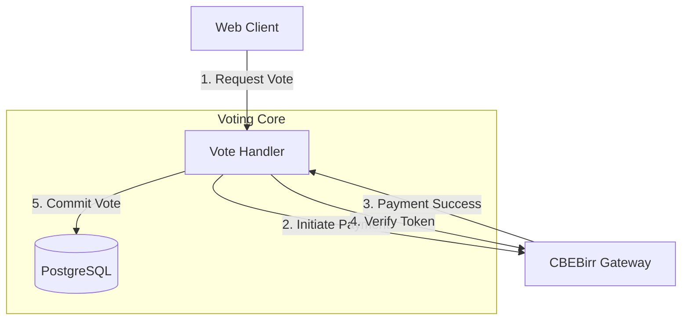

# Voting & Payment Requirements Specification

**Document Version:** 1.0 (Focused)
**Date:** 2026-02-03
**Status:** Approved for Development

---

## 1. Executive Summary

The **Studio Awards Platform** voting system is a high-integrity component designed to facilitate the Cultural Ambassador Award. This document details the technical specifications, business logic, and security measures strictly related to the **Voting** and **Payment** modules. 

The system ensures fair play through rigorous anti-fraud measures and integrates directly with **CBEBirr** for secure, verified paid voting.

---

## 2. System Actors & Access Control

| Actor | Description | Access Level |
| :--- | :--- | :--- |
| **Guest (Voter)** | Public user visiting the site. | **Read-Only:** Nominees. **Write:** Vote (Paid, 1/transaction). |
| **System (Payment)**| CBEBirr Payment Gateway. | **Write:** Payment Confirmation Callbacks. |
| **Admin** | System operator. | **Read:** Vote Logs, Payment Records. |

---

## 3. Functional Requirements Specification (FRS)

### 3.1 Voting System
- **FR-V-01 (Vote Casting):** The system shall allow users to vote for a nominee within a specific category.
- **FR-V-02 (Rate Limiting & Payment):** Voting is gated by successful payment. 
  - **Constraint:** One successful payment transaction equals one valid vote.
- **FR-V-03 (Anti-Fraud):** The system shall record a browser fingerprint and IP address for every vote to detect patterns of abuse (e.g., bot farms) even for paid votes.
- **FR-V-04 (Eligibility):** Votes must only be accepted for Nominees marked as `isActive: true`.
- **FR-V-05 (Payment Integration):** The system shall integrate with the **CBEBirr API** for payment processing.
  - **Constraint:** Votes must **only** be counted after a successful "Job Done" / "Payment Received" confirmation from CBEBirr.
  - **Flow:** User funds vote -> CBEBirr processes -> Success Callback -> Vote Recorded.

---

## 4. Non-Functional Requirements (NFR)

- **NFR-SEC-01 (Transaction Integrity):** Payment confirmation tokens must be unique and non-reusable.
- **NFR-SEC-02 (Data Integrity):** Foreign key constraints must be maintained between `Nominee` -> `Vote`.
- **NFR-PERF-01 (Response Time):** Voting API endpoints should respond within **200ms** (excluding payment gateway latency).
- **NFR-COM-01 (Scoring Rules):** The final winner calculation must support a weighted average: **70% Public Vote** + **30% Jury Score**.

---

## 5. System Architecture (Voting & Payment)

### 5.1 Technology Stack
- **Frontend:** Next.js 15 (App Router).
- **Backend:** Next.js Route Handlers (`/app/api/votes`).
- **Database:** PostgreSQL (via Supabase).
- **ORM:** Prisma Client.
- **Payment Gateway:** CBEBirr API.

### 5.2 Component Diagram

---

## 6. Data Dictionary (Relevant Schema)

### 6.1 Core Tables
| Table | Description | Key Fields | Constraints |
| :--- | :--- | :--- | :--- |
| `Nominee` | Award Candidates | `id`, `categoryId`, `voteCount`, `isActive` | `voteCount` defaults 0. |
| `Vote` | Vote Records | `id`, `userId`, `nomineeId`, `paymentToken`, `amount`, `status` | `paymentToken` unique. |

---

## 7. Business Logic & Process Flows

### 7.1 Voting Logic (Pseudo-code)
1. **Receive Request:** `POST /api/votes` with `{ nomineeId, fingerprint, paymentToken }`.
2. **Identify Voter:** Extract IP address to prevent abuse (though payment acts as primary Sybil resistance).
3. **Process Payment (CBEBirr):**
   - Call **CBEBirr API** to verify transaction status.
   - **IF** status != "Payment Received/Job Done": Return `402 Payment Required`.
4. **Execute Vote:**
   - Transaction:
     - `INSERT INTO Vote` (with payment reference).
     - `UPDATE Nominee SET voteCount = voteCount + 1`.
5. **Return:** `201 Created` with updated vote count.

---

## 8. Security & Threat Model

### 8.1 Mitigations
- **Vote Manipulation:**
  - **Mitigation:**
    - **Payment Gating:** Effectively prevents mass-botting by requiring financial transaction per vote.
    - **Fingerprinting:** Browser fingerprinting to detect clearing cookies/incognito.
- **Injection Attacks:**
  - **Mitigation:** Prisma ORM fully parameterizes queries, preventing SQL injection.
- **Data Validation:**
  - **Mitigation:** Zod schemas in every API route validate structure, types, and constraints (e.g., `paymentToken` format).
