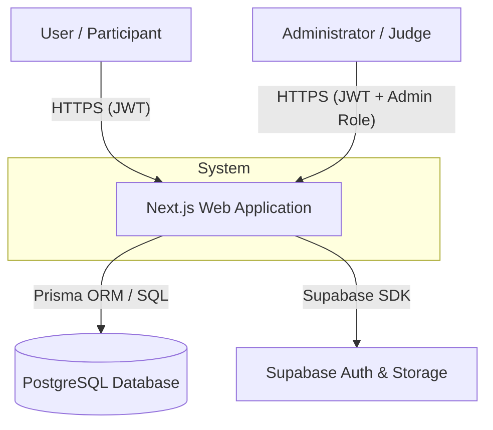
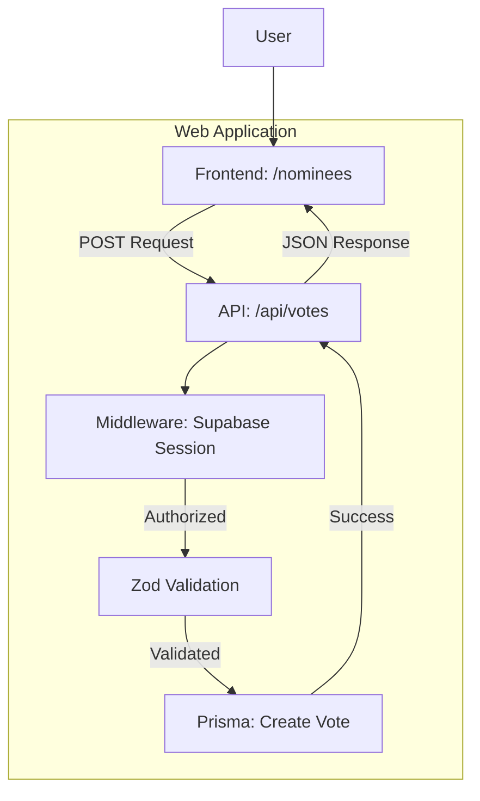
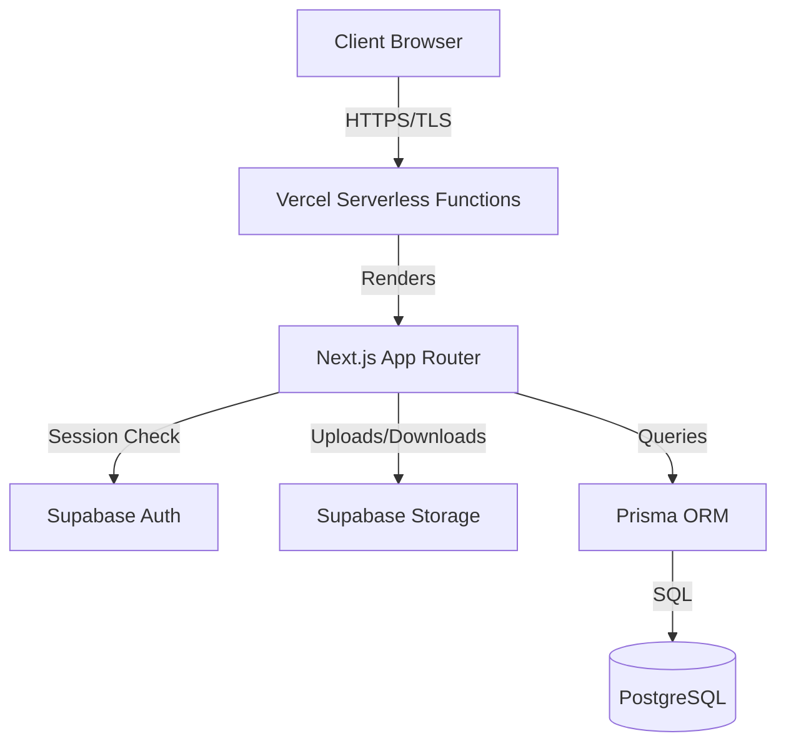

# Technical Security Audit & Implementation Details

This document provides a comprehensive technical overview and security specification for the Cultural Ambassador Award web application, as required for the security audit by the Information Network Security Administration (INSA).

## 4.2 Technical Documentation for Web Application Security Testing

### 4.2.1 Business Architecture and Design

#### a) Data Flow Diagram (DFD)

**Context-Level DFD (Level 0)**

**Detailed DFD (Level 1 - Voting Process)**

#### b) System Architecture Diagram

The application is a full-stack Next.js application deployed on Vercel, using Supabase for Authentication and Storage, and PostgreSQL for the primary data store.

**Core Security Layers:**
1.  **Transport Layer Security (TLS):** All traffic is encrypted via HTTPS (managed by Vercel).
2.  **Authentication:** Managed by **Supabase Auth** (JWT-based).
3.  **Authorization:** Role-Based Access Control (RBAC) enforced via server-side helpers (`isAdmin`, `requireAdmin`) and database user roles.
4.  **Database Security:** **Prisma ORM** prevents SQL injection. **PostgreSQL** schema enforces data integrity.
5.  **Infrastructure Security:** Vercel Provides DDoS protection and WAF.

### 4.2.2 System Components and Dependencies

#### Core Frameworks & Plugins
| Name | Role | Version |
| :--- | :--- | :--- |
| **Next.js** | Core Framework (React) | `^15.5.7` |
| **Prisma** | Database ORM | `^6.19.0` |
| **Supabase SSR** | Session & Cookie management | `^0.8.0` |
| **Supabase JS** | Database & Storage SDK | `^2.87.1` |
| **Clerk NextJS** | Alternative Auth (Optional/Legacy) | `^6.36.1` |
| **Tailwind CSS** | Styling Engine | `^3.4.1` |
| **ShadCN UI** | UI Component Library | (Built on Radix UI) |
| **Lucide React** | Icons Library | `^0.475.0` |
| **Zod** | Schema Validation | `^3.25.76` |
| **Genkit AI** | AI Suggester / Generation | `^1.20.0` |
| **Sentry** | Error Tracking & Monitoring | `^10.29.0` |

#### Data Models (Prisma Variables)
| Model | Key Fields (Variables) | Description |
| :--- | :--- | :--- |
| **User** | `id`, `email`, `name`, `role`, `photoURL` | Stores user credentials and RBAC roles. |
| **Category** | `id`, `name`, `slug`, `description`, `imageUrl`, `order`, `isActive` | Groups nominees (e.g., Traditional Dance). |
| **Nominee** | `id`, `name`, `bio`, `imageUrl`, `videoUrl`, `categoryId`, `region`, `scope`, `featured`, `voteCount`, `isActive` | The individuals/groups being voted on. |
| **NomineeMedia** | `id`, `nomineeId`, `type`, `url`, `thumbnail`, `description`, `hint`, `order` | Gallery items for nominees. |
| **Vote** | `id`, `nomineeId`, `userId`, `ipAddress`, `fingerprint` | Records of user votes. Unique on `[userId, nomineeId]`. |
| **Submission** | `id`, `title`, `description`, `category`, `fileUrl`, `fullName`, `email`, `phone`, `portfolioUrl`, `status` | Public nomination submissions. |
| **Popup** | `id`, `type`, `title`, `description`, `videoUrl`, `imageUrl`, `imageLink`, `isActive`, `delaySeconds`, `storageKey` | Marketing/Information popups. |
| **TimelineEvent** | `id`, `title`, `description`, `date`, `order`, `isActive` | Event schedule markers. |
| **CulturalInsight** | `id`, `title`, `content`, `author`, `imageUrl`, `category`, `isPublished` | Educational blog/article content. |
| **AdConfig** | `id`, `leftAdImage`, `leftAdLink`, `leftAdActive`, `rightAdImage`, `rightAdLink`, `rightAdActive` | Configuration for sidebar advertisements. |

### 4.2.3 Technical Functionality Breakdown

#### API Endpoints & Core Functions
All API logic resides in `src/app/api/`.

| Endpoint | HTTP Method | Functionality | Handler Logic (Functions) |
| :--- | :--- | :--- | :--- |
| `/api/categories` | GET | List active categories | `from('categories').select('*').eq('isActive', true)` |
| `/api/categories` | POST | Create category | `requireAdmin`, `name.toLowerCase().replace(...)` (Slug gen) |
| `/api/nominees` | GET | List nominees | `prisma.nominee.findMany` with relations |
| `/api/nominees` | POST | Create nominee | `requireAdmin`, `prisma.nominee.create` |
| `/api/votes` | POST | Cast a vote | `requireAuth`, `prisma.vote.create`, `prisma.nominee.update` (inc voteCount) |
| `/api/popups` | GET | Fetch active popup | `prisma.popup.findFirst` where `isActive: true` |
| `/api/admin/stats` | GET | Dashboard stats | `requireAdmin`, multiple `prisma.count()` calls |
| `/api/upload` | POST | File upload | `requireAuth`, `supabase.storage.from(...).upload` |

#### Security Verification Functions (`src/lib/auth-helpers.ts`)
- `isAdmin()`: Checks if the current authenticated user has the 'admin' role in the database.
- `requireAuth()`: Ensures the user is logged in via Supabase; returns `userId`.
- `requireAdmin()`: Utility that throws an error if `isAdmin()` is false.

#### Request Validation (`zod`)
Schema validation for incoming request bodies:
- `nomineeSchema`: Validates name, bio, image, and category.
- `submissionSchema`: Validates contact info and file URL.
- `voteSchema`: Validates nominee ID.

### 4.2.4 Functional Requirements

1.  **Authentication & Profile:**
    -   Users can register and log in via email/password.
    -   Users can view their activity on a personal dashboard.
2.  **Voting System:**
    -   Users (Participants) can cast ONE vote per nominee.
    -   Real-time vote counting (buffered/cached where appropriate).
    -   Duplicate prevention using `userId` + `nomineeId` unique constraints.
3.  **Nomination Submissions:**
    -   Public users can submit nominations for various categories.
    -   Support for uploading evidence (images/documents) to Supabase Storage.
4.  **Admin Management:**
    -   Full CRUD (Create, Read, Update, Delete) for Categories, Nominees, and Media.
    -   Status management for submissions (Pending, Approved, Rejected).
    -   Content management for Cultural Insights and Timeline Events.
5.  **Analytics & Reporting:**
    -   Admin dashboard showing total votes, users, and submissions.

### 4.2.5 Non-Functional Requirements

1.  **Security (Integrity & Confidentiality):**
    -   All passwords hashed and stored by Supabase Auth.
    -   JWT validation on every protected API call.
    -   CORS policies restricted to authorized domains.
2.  **Availability:**
    -   Serverless functions (Next.js/Vercel) provide 99.9% uptime.
    -   Hosted PostgreSQL (Supabase/Vercel) with automated backups.
3.  **Performance:**
    -   Edge rendering and image optimization for fast page loads globally.
    -   Database indexing on primary search fields (`slug`, `email`, `role`, `status`).
4.  **Reliability:**
    -   Transactional database operations (Prisma) ensure no partial data writes.
    -   Error logging via Sentry for proactive issue resolution.
5.  **Scalability:**
    -   Horizontal scaling via Vercel Edge Network.
    -   Database connection pooling for high concurrency.

### 4.2.6 Threat Modeling (STRIDE)

| Threat | Description | Variable/Mitigation |
| :--- | :--- | :--- |
| **Spoofing** | User impersonation | Using `supabase.auth.getUser()` server-side to verify JWT on every request. |
| **Tampering** | Data modification in transit | HTTPS/TLS enforced. Zod validation for all input fields. |
| **Repudiation** | Action denial | `Vote` and `User` IDs recorded for all critical actions. |
| **Information Disclosure** | Leak of sensitive data | API responses filtered to omit sensitive DB fields; strict RBAC. |
| **Denial of Service** | Resource exhaustion | Vercel DDoS protection; API rate limiting (handled at edge). |
| **Elevation of Privilege**| Unauthorized admin access | Middleware-level `isAdmin` checks; RBAC role field in DB. |

### 4.2.7 Secure Coding Standards

- **SQL Injection:** Avoided by using Prisma's parameterized queries for all database interactions.
- **XSS:** Next.js automatically sanitizes content in JSX; `dangerouslySetInnerHTML` is avoided or used with trusted sanitizers.
- **CSRF:** Next.js App Router includes built-in protection for form submissions and server actions.
- **Dependencies:** Regular scans using `npm audit` and Sentry alerting for runtime vulnerabilities.

---
## Contact Information

For technical inquiries or security audit coordination:
- **Project Lead & Developer**: Yonas Mulugeta - [yoni.win.yw@gmail.com](mailto:yoni.win.yw@gmail.com)

---
**End of Technical Documentation**
